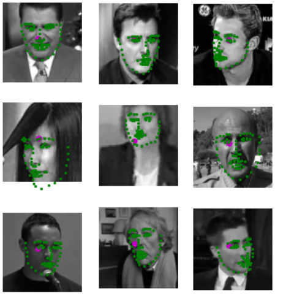
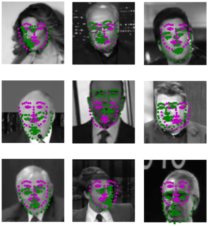

[//]: # (Image References)

# Facial Keypoint Detection using Convolutional Neural Networks

## Installation steps:
- Clone this repository to your home directory:
```
$ git clone https://github.com/AndresGarciaEscalante/Facial_Kepoints_CNN.git
```
- Install PyTorch and torchvision; this should install the latest version of PyTorch.
	
	- __Linux__ or __Mac__: 
	```
	conda install pytorch torchvision -c pytorch 
	```
	- __Windows__: 
	```
	conda install pytorch-cpu -c pytorch
	pip install torchvision
	```

- Install a few required pip packages, which are specified in the requirements text file (including OpenCV).
```
pip install -r requirements.txt
```

## Project Overview

This project is part of the **Computer Vision Nanodegree** from **Udacity**, and you’ll combine your knowledge of computer vision techniques and deep learning architectures to build a facial keypoint detection system. Facial keypoints include points around the eyes, nose, and mouth on a face and are used in many applications. These applications include: facial tracking, facial pose recognition, facial filters, and emotion recognition. Your completed code should be able to look at any image, detect faces, and predict the locations of facial keypoints on each face; examples of these keypoints are displayed below.

<p align="center">
  
</p>

The project will be broken up into a few main parts in four Python notebooks, **only Notebooks 2 and 3 (and the `models.py` file) will be graded**:

__Notebook 1__ : Loading and Visualizing the Facial Keypoint Data

__Notebook 2__ : Defining and Training a Convolutional Neural Network (CNN) to Predict Facial Keypoints

__Notebook 3__ : Facial Keypoint Detection Using Haar Cascades and your Trained CNN

__Notebook 4__ : Fun Filters and Keypoint Uses

**Capture File (BONUS)**: Contains the real-time face detection and face keypoints detecion using the camera of your computer.  

## Data
All of the data you'll need to train a neural network is in the P1_Facial_Keypoints repo, in the subdirectory `data`. In this folder are training and tests set of image/keypoint data, and their respective csv files. This will be further explored in Notebook 1: Loading and Visualizing Data, and you're encouraged to look trough these folders on your own, too.

## Project Outcome
The project implements the prediciton of Facial Keypoints (68 keypints) in a image. The results of the model for this task can be shown bellow:  

### Not Trained Model 
For this experiment, it was decided to test the performance of the model in detecting the keypoints without training the model. The green points are the grouth truth and the magenta points are the prediciton of the model:

<p align="center">
  
</p>

### Trained Model
The performance of the model increased with 8 epochs of training. The results of the prediction of Keypoints are shown bellow:

<p align="center">
  
</p>

### Real-Time Face and Keypoints Detection 
The implementation of the model worked fine in a real-time face and keypoints detection. The following image is an example of how the detections looks like:

<p align="center">
  
</p>

**Important:** Check full video of the [Real-Time Face and Keypoints Detection](https://www.youtube.com/watch?v=CUUeepdJkQc)


## Future Improvements
- Incorporate a new script that can overlay images (sun glasses, hats, among others) to any specific section of the keypoints. 
